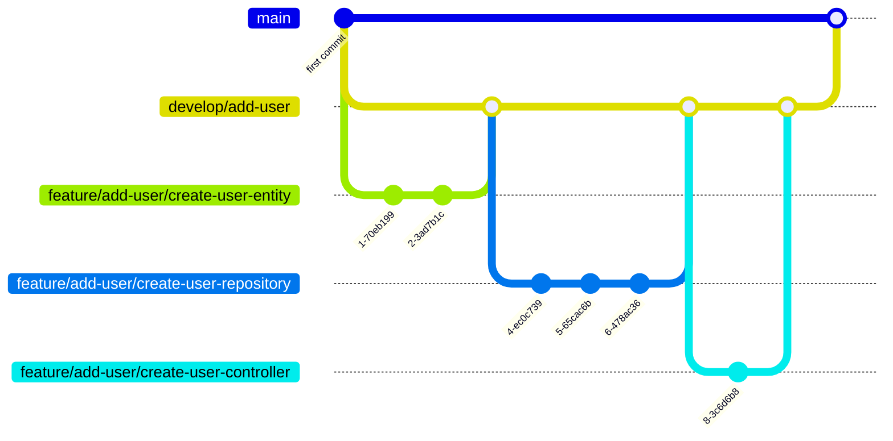

## 開発を始めるために

基本的には docker ベースで開発を進めるので[Docker デスクトップ](https://www.docker.com/ja-jp/products/docker-desktop/)さえあれば問題なく開発が進められる認識です。

また、動作確認には postman が使用できるとスムーズに開発できると思います。

## 環境構築手順

```
docker compose build
docker compose up
chmod +x ./setup_database.sh
./setup_database.sh
```

## 開発フロー

基本的に以下サイクルで開発を行う想定です。
タスク管理については Github Project で運用を行っていく想定でおり、`タスク : issue : PR(Pull Request) = 1 : 1 : 1`となります。

1. 設計
2. 設計レビュー
3. 開発
4. PR
5. PR レビュー
6. マージ

### 設計

以下の要点を issue 上にまとめてください。

- タスクが完了される条件
- タスクが解決する仕様
- 必要な要件
- 必要になりそうな実装
  - どんなクラスが必要になる?
  - どんな関数が必要になる?
  - どんな型定義が必要になる?
  - 必要そうならフロー図やシーケンス図も添えて

これらがあらかじめ洗い出せていれば、実装後の差し戻しなどを防げる他、他作業者とコンフリクトしそうな部分があらかじめ検討をつけられます。

また、後からコードの仕様を確認したい場合に読み返せるのも利点です。(オンボーディング時に参照する資料としても活用できる)

### 設計レビュー

設計レビューは、設計段階で見つけた課題や提案をチーム全体で共有し、設計内容の品質を向上させるためのステップです。
以下の要点に従って、設計レビューを行います。

- レビュー方法: 設計内容を GitHub issue上でドキュメントとして共有し、レビューを依頼します。
- レビューポイント:
  - 仕様に漏れや矛盾がないか。
  - 設計がシンプルで保守しやすいか。
  - 他のモジュールやシステムとの整合性が取れているか。
  - 実装する際に課題になりそうな点がないか。
- レビューの流れ:
  - レビュー担当者は設計書を確認し、コメントを残します。
  - 提案された改善点や修正が必要な点について、設計者とレビュー担当者でコメント上で(必要があれば口頭で)会話を行います。
  - 設計書の最終的な修正が完了し、1Approveでレビューを完了とします。

### 開発

設計レビューが完了したら、実際の開発に移ります。以下のフローで進行します。

- コード実装:
  - 設計書に基づき、必要なクラス、関数、型定義を実装します。
  - 実装中に気づいた追加の要件や変更点があれば、issue に追記し、必要に応じて設計書も更新します。
- テスト作成:
  - 単体テストを作成し、実装したコードが正しく動作することを確認します。
  - 必要に応じて、統合テストやエンドツーエンドテストも作成します。
  - テストを書く粒度については別途記載します。
- セルフレビュー:
  - コードの可読性、保守性を確認し、設計意図に沿っているか自己チェックします。
  - 静的解析ツールやリンターを使い、コードスタイルや潜在的なバグをチェックします。(コミットのタイミングでprettier, eslintによるチェックが行われます。)

### PR

開発が完了したら、コードをプッシュし、PR を作成します。

- PR 作成:
  - PR のタイトルは、誰が見ても「何を対応したのか」「何を解決するPRなのか」をなるべく簡潔に明記します。
  - PRの内容についてはテンプレートに沿って記載する。
  - レビュー負荷を下げるためにもテストコードを抜いた差分が100行程度が望ましい。ただ新規開発においては、その限りではなく「レビューしやすいコンテキスト」でまとまっていればOK(とはいえ200行以上は辛いので避けてほしい)
    - 基本的に差分が異常に多いPRを一つ見るより、差分が少ないPRを複数見るほうがレビュー負荷は小さいです。
    - 例え差分が1行だったとしてもそれが適切なコンテキストのタスクとしてまとまっているなら全然OK
    - 差分は「小さければ小さいほど良い」と考えても良さそう
- PR の関連付け:
  - PR は該当する issue にリンクされ、タスク : issue : PR = 1 : 1 : 1 の原則を守ります。
  - 必要なラベルを付けて、PR の内容を明確にします (例: feature, bugfix, refactor など)。
- PR の通知:
  - レビュー担当者に通知し、レビュー依頼を行います。

### PR レビュー

PR はチームメンバーによってレビューされます。レビューの主な目的は、コードの品質を保ち、バグを未然に防ぐことです。
基本的に、レビュイー(実装者)の意見を第一として優先します。

- レビュー手順:
  - コードの全体を確認し、設計意図通りに実装されているかチェックします。
  - コードの可読性、命名規則、コメントの有無なども確認します。
  - パフォーマンスやセキュリティに関する懸念点があれば、指摘します。
  - 必要に応じて、追加のテストやリファクタリングの提案を行います。
- レビューのフィードバック:
  - レビューのコメントは具体的に記述し、可能であれば代替案も提示します。
  - レビューで指摘された箇所は、開発者が修正し再レビューを依頼します。
- レビューに仕様するprefix
  - prefixなし: 基本的に対応してほしい場合はこれ。MUSTをつけるのには若干勇気いるので...。それ以外にも「この実装いいね！」とか「これ勉強になりました！」みたいなコメントも大歓迎。
  - IMO(In My Opinion): これは対応必須ではない。実装者の判断で修正するかしないか決める。
  - ASK: 質問したい時に使用する。このコメントがついた時は、答えてあげましょう。
  - FYI(For Your Information): 参考までの情報を提供したいとき。
  - NITS(nitpick): 重箱の隅を突つくレベルの些細な指摘。(タイポとかの指摘が代表的な例。)これも対応必須ではない。実装者の判断で修正するかしないか決める。
- レビューワー側でIMOやNITSのコメントを使用した場合、基本的に対応必須ではないので、Approveしましょう。(MUSTで対応してほしい場合はprefixをつけない！)
- レビュイー側でIMOやNITSのコメントをもらった場合、対応するかしないかの判断はレビュイー側で行います。その際、どう判断したかなぜその判断をしたかのコメントは必ず返しましょう。
- IMOやNITSの対応は次のPRに持ち越して修正とかも全然OK!!開発 → レビュー → Approve → Mergeのサイクルを早く回したい。

### マージ

PR が**2Approve**されたら、**レビュイー**(**実装者**)がマージします。

- マージ方法:
  - マージ前に、ブランチが最新の親ブランチと競合していないかを確認します。
  - 必要に応じて、Rebase を行い、コミット履歴を整理します。
  - **スカッシュマージは禁止**とします。
    - 詳細なコミット履歴が失われてしまうため。
    - 今回の開発では個々人が大粒度のタスクごとにdevelopブランチを持つことになります。developブランチは差分が大きくなると予想されます。一つのコミットの差分が大きくなるのを避けたいです。
    - 単純にスカッシュマージ起因のコンフリクトを避けたいです。
- マージ後のタスク:
  - issue をクローズします。
  - GOTCHA!!!!!

## git 運用ルール

### ブランチ戦略

開発段階では主に以下 3 つで運用しています。
ブランチ名で環境ごとに CI を回したいのでこちらを厳守いただきたいです。

- master
- develop/xxx(ex: develop/add-user)
- feature/xxx/○○○(ex: feature/add-user/create-user-entity)

手順としては、

1. 機能ごとに master から develop ブランチを切る
2. タスクごとに develop ブランチから feature ブランチを切る
3. 開発完了後 develop にマージ
4. 機能単位で全ての実装が終わったら develop を master にマージする

みたいなイメージです。

develop が master にマージされる時に、自動デプロイが走るようにしたいので、develop ブランチではエラーが出ていない状態(=機能単位で使用ができる状態)でマージをする必要があります。(github-flow ではなく git-flow を採用した理由はここにある)



### コミットメッセージ

適切な粒度でコミットは切ってほしい。
そのコミットが何を解決するのか、という単位で切るのが理想だと思ってます。

#### 仕様するprefix

仕様するprefixは以下に絞るのが良さそうと思ってます。

- feat: 機能の開発や、アップデート、追加に関わるコミット。(おそらくほとんどがこれになる。)
- fix: バグの修正を対応したコミット
- refactor: バグの修正ではないリファクタリングに関わる修正を対応したコミット
- test: テストコードに関わる対応を行なったコミット

意図としてはprefixを使用するのをルールづけることで「どんな粒度でコミットを切ろうか?」と考えるきっかけとなる。その反面、prefixの種類が多すぎると運用が面倒になるというデメリットがあるので、上記の4つだけに絞りたいなと思ってます。

## 自動テストの考え方
