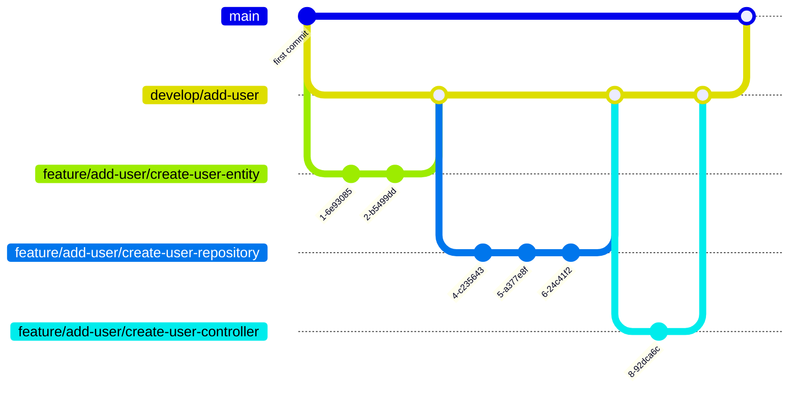

## 開発を始めるために

基本的には docker ベースで開発を進めるので[Docker デスクトップ](https://www.docker.com/ja-jp/products/docker-desktop/)さえあれば問題なく開発が進められる認識です。

また、動作確認には postman が使用できるとスムーズに開発できると思います。

## 開発フロー

基本的に以下サイクルで開発を行う想定です。
タスク管理については Github Project で運用を行っていく想定でおり、`タスク : issue : PR(Pull Request) = 1 : 1 : 1`となります。

1. 設計
2. 設計レビュー
3. 開発
4. PR
5. PR レビュー
6. マージ

### 設計

以下の要点を issue 上にまとめてください。

- タスクが完了される条件
- タスクが解決する仕様
- 必要な要件
- 必要になりそうな実装
  - どんなクラスが必要になる?
  - どんな関数が必要になる?
  - どんな型定義が必要になる?
  - 必要そうならフロー図やシーケンス図も添えて

これらがあらかじめ洗い出せていれば、実装後の差し戻しなどを防げる他、他作業者とコンフリクトしそうな部分があらかじめ検討をつけられます。

また、後からコードの仕様を確認したい場合に読み返せるのも利点です。(オンボーディング時に参照する資料としても活用できる)

### 設計レビュー

Github 上で

### 開発

### PR

### PR レビュー

### マージ

## git 運用ルール

### ブランチ戦略

開発段階では主に以下 3 つで運用しています。
ブランチ名で環境ごとに CI を回したいのでこちらを厳守いただきたいです。

- master
- develop/xxx(ex: develop/add-user)
- feature/xxx/○○○(ex: feature/add-user/create-user-entity)

手順としては、

1. 機能ごとに master から develop ブランチを切る
2. タスクごとに develop ブランチから feature ブランチを切る
3. 開発完了後 develop にマージ
4. 機能単位で全ての実装が終わったら develop を master にマージする

みたいなイメージです。

develop が master にマージされる時に、自動デプロイが走るようにしたいので、develop ブランチではエラーが出ていない状態(=機能単位で使用ができる状態)でマージをする必要があります。(github-flow ではなく git-flow を採用した理由はここにある)

### コミットメッセージ

## 自動テストの考え方
